# Of Two Minds: A registered replication

Frederik Aust, Tobias Heycke, Benedek Kurdi, Pieter Van Dessel, Jeremy
Cone, Melissa J. Ferguson, Xiaoqing Hu, Congjiao Jiang, Robert J.
Rydell, Lisa Spitzer, Christoph Stahl, Christine Vitiello, & Jan De
Houwer

<!-- ](https://doi.org/10.31234/osf.io/v674w) -->

[](https://doi.org/10.31234/osf.io/v674w)
[](https://osf.io/v674w)
[](https://osf.io/v674w)

<!-- []() -->
<hr />

This repository contains research products associated with the above
publication. We provide the experimental software and stimulus material
that we are permitted to share in the `material` directories of each
experiment (e.g. `otm1` or `otm2`). The preregistration document for
Experiment 1 is provided in `otm1/preregistration`. The
`results/data_raw` directories of each experiment contain all the raw
data; merged and processed data files can be found in
`results/data_processed`. The R Markdown file `manuscript.Rmd` in the
`paper` directory can be rendered to reproduce the manuscript using the
R package `papaja`.

*Please see below for more details on the data, software requirements,
computational requirements, and steps to reproduce the analyses.*

## Screen recordings

To give a vivid impression of the experimental procedure, an examplary
screen recording of the procedure is available under
`otm1/screen_recordings`.

1.  `otm_1_sr_complete.mp4`: An example of the full procedure (please
    note that this is not a recording of any of the participants)
2.  `otm_1_sr_overview.mp4`: A shorted version of the video to give a
    brief overview of all parts of the procedure (please note that the
    video does not reflect the actual procedure)

## Data

The `results/data_raw` directories of each experiment contain all the
raw data. For each participant there are seven files. The following
files are available for each participant (here shown for participant 101
of Experiment 1 at the University of Cologne):

| No. | Description              | File name                               |
|-----|--------------------------|-----------------------------------------|
| 1\. | Demographics             | `Data_Demographics_OTM_Cologne_101.dat` |
| 2\. | Record of learning phase | `DataTrials_OTM_101.dat`                |
| 3\. | Attitude ratings         | `DataEval_OTM_101.dat`                  |
| 4\. | IAT data (trial-level)   | `DataIAT_OTM_101.dat`                   |
| 5\. | Recognition data         | `DataMemTest_OTM_101.dat`               |
| 6\. | General log file         | `OTM_Log_Cologne_101.dat`               |
| 7\. | Frame rate data          | `OTM_ScreenLog_Cologne_101.dat`         |

For a description of the variables in each file, please see the files
`results/codebooks/data_raw/` of each experiment.

Merged and processed data files can be found in
`results/data_processed`. The code used to merge and process the data is
available in the **targets** pipelines in the `results` directories of
each experiment (e.g., `_targets_otm1.r`; see below for details on how
to run the analyses). The data used for the analyses reported in the
paper are (here shown for Experiment 1):

| No. | Description                                                                                                                                                                                                                               | File name                      |
|-----|-------------------------------------------------------------------------------------------------------------------------------------------------------------------------------------------------------------------------------------------|--------------------------------|
| 1\. | Direct and indirect attitude scores separately for each block of the learning procedure and valence order                                                                                                                                 | `otm1_attitudes.rds`           |
| 2\. | Direct and indirect attitude scores with block of learning procedure recoded such that 1 represents the block with positive behavior description and 2 the block with negative behavior description (used for Bayesian model comparisons) | `otm1_attitudes_collapsed.rds` |
| 3\. | End-of-experiment recognition memory responses for briefly flashed words, demographic information, and responses to open-ended questions                                                                                                  | `otm1_memory.rds`              |

For a description of the variables in each dataset, please see the files
`results/codebooks` of each experiment.

## Software requirements

### Experimental software

The experiment was programmed using PsychoPy 1.82.01 and 1.83.01. *One
of these versions must be installed to run the experiment.* All files to
reproduce the procedure can be found in the `material` directories of
each experiment.

A folder called `data` (where output data is recorded), needs to be
present in the same folder as the Python script to run the experiment.

### Analyses

The version of R and all packages required to reproduce the anlysis are
listed in the `DESCRIPTION` file. It is required to install the archived
version of `spatialfil` package (version 0.15):

``` r
# From CRAN archive
remotes::install_version("spatialfil", dependencies = "0.15")

# Or from this repository
# remotes::install_local("./spatialfil_0.15.tar.gz")
```

When the repository is cloned, the other R package dependencies can be
installed directly from the `DESCRIPTION` :

``` r
# Install all remaining dependencies
remotes::install_deps()
```

## Computational requirements

Running all analyses may take a long time on a Desktop computer. The
following diagram shows the products of the **targets** pipelines for
each experiment, their dependencies, and computation time.

### Experiment 1

``` mermaid
graph LR
  style Legend fill:#FFFFFF00,stroke:#000000;
  style Graph fill:#FFFFFF00,stroke:#000000;
  subgraph Legend
    xf1522833a4d242c5(["Up to date"]):::uptodate
    x2db1ec7a48f65a9b(["Outdated"]):::outdated
    xbecb13963f49e50b{{"Object"}}:::none
    xeb2d7cac8a1ce544>"Function"]:::none
    xd03d7c7dd2ddda2b(["Regular target"]):::none
    x6f7e04ea3427f824["Dynamic branches"]:::none
  end
  subgraph Graph
    direction LR
    xebd52189908b7113>"invert_subscript"]:::uptodate --> x5512318a8de090c6>"apa_print_bf.numeric"]:::uptodate
    x22891fac2c76433e>"typeset_scientific"]:::uptodate --> x5512318a8de090c6>"apa_print_bf.numeric"]:::uptodate
    x8a66cb8c44d73a56>"eiv_loglik"]:::uptodate --> x94109b123e25ff82>"eiv_lm"]:::uptodate
    xfa7597b317fa6753>"g_map"]:::uptodate --> xe896a0789aac9abb>"n_way_anova"]:::uptodate
    x55749fe9af4cb51d>"r_scale"]:::uptodate --> xe896a0789aac9abb>"n_way_anova"]:::uptodate
    x0920c189f00eaac5(["otm1_unconstrained_samples<br>27.1s"]):::uptodate --> x49bd5e7f3609ed37(["otm1_analysis<br>30.7s"]):::uptodate
    xa936cda5f5677988(["otm1_attitudes_collapsed<br>5ms"]):::uptodate --> x49bd5e7f3609ed37(["otm1_analysis<br>30.7s"]):::uptodate
    x52d22db802a78872(["otm1_unconstrained_pp<br>12.9s"]):::uptodate --> x49bd5e7f3609ed37(["otm1_analysis<br>30.7s"]):::uptodate
    xf77248d034ec7384(["otm1_no_lab_effect<br>12h 25m 51.6s"]):::uptodate --> x49bd5e7f3609ed37(["otm1_analysis<br>30.7s"]):::uptodate
    x7315f5df0dc3093b(["otm1_iat_lmer<br>14m 20.9s"]):::uptodate --> x49bd5e7f3609ed37(["otm1_analysis<br>30.7s"]):::uptodate
    x1cf8b0e8f9fac3bc(["otm1_iat2_lme<br>35ms"]):::uptodate --> x49bd5e7f3609ed37(["otm1_analysis<br>30.7s"]):::uptodate
    x6bc84d71988ef714(["otm1_attitudes<br>109ms"]):::uptodate --> x49bd5e7f3609ed37(["otm1_analysis<br>30.7s"]):::uptodate
    x146b98b915782275(["otm1_unconstrained<br>13h 34m 5.9s"]):::uptodate --> x49bd5e7f3609ed37(["otm1_analysis<br>30.7s"]):::uptodate
    xb701179d8a651b0f(["otm1_log<br>19ms"]):::uptodate --> x49bd5e7f3609ed37(["otm1_analysis<br>30.7s"]):::uptodate
    x15b638cd821903a1(["otm1_no_effect<br>13h 37m 15.8s"]):::uptodate --> x49bd5e7f3609ed37(["otm1_analysis<br>30.7s"]):::uptodate
    x666d71fadfb53146(["otm1_n_mcmc_samples<br>838ms"]):::uptodate --> x49bd5e7f3609ed37(["otm1_analysis<br>30.7s"]):::uptodate
    xc9bcbf9ce6971566(["otm1_iat2<br>80ms"]):::uptodate --> x49bd5e7f3609ed37(["otm1_analysis<br>30.7s"]):::uptodate
    xc54a013649e91e86(["otm1_memory<br>15ms"]):::uptodate --> x49bd5e7f3609ed37(["otm1_analysis<br>30.7s"]):::uptodate
    x65964d8cee72cae4(["otm1_technical_failure<br>839ms"]):::uptodate --> x49bd5e7f3609ed37(["otm1_analysis<br>30.7s"]):::uptodate
    x6bc84d71988ef714(["otm1_attitudes<br>109ms"]):::uptodate --> x109b8ac05075c22b(["otm1_attidudes_codebook<br>4ms"]):::uptodate
    xc54a013649e91e86(["otm1_memory<br>15ms"]):::uptodate --> x6bc84d71988ef714(["otm1_attitudes<br>109ms"]):::uptodate
    x04a786e5cb4e2e50(["otm1_eval2<br>132ms"]):::uptodate --> x6bc84d71988ef714(["otm1_attitudes<br>109ms"]):::uptodate
    x65964d8cee72cae4(["otm1_technical_failure<br>839ms"]):::uptodate --> x6bc84d71988ef714(["otm1_attitudes<br>109ms"]):::uptodate
    xc9bcbf9ce6971566(["otm1_iat2<br>80ms"]):::uptodate --> x6bc84d71988ef714(["otm1_attitudes<br>109ms"]):::uptodate
    x6bc84d71988ef714(["otm1_attitudes<br>109ms"]):::uptodate --> xa936cda5f5677988(["otm1_attitudes_collapsed<br>5ms"]):::uptodate
    xa936cda5f5677988(["otm1_attitudes_collapsed<br>5ms"]):::uptodate --> x7de018286ec8200a(["otm1_attitudes_collapsed_codebook<br>3ms"]):::uptodate
    xa936cda5f5677988(["otm1_attitudes_collapsed<br>5ms"]):::uptodate --> xbbf5ba6b97469185(["otm1_attitudes_collapsed_share<br>1ms"]):::uptodate
    x6bc84d71988ef714(["otm1_attitudes<br>109ms"]):::uptodate --> x51090a5234785938(["otm1_attitudes_share<br>1ms"]):::uptodate
    xb7593c7bc0545136(["otm1_demo_paths<br>4ms"]):::uptodate --> x955ec52fa68b360c(["otm1_demo<br>65ms"]):::uptodate
    x955ec52fa68b360c(["otm1_demo<br>65ms"]):::uptodate --> xf3d78d651e314dd7(["otm1_demo_codebook<br>2ms"]):::uptodate
    xb7593c7bc0545136(["otm1_demo_paths<br>4ms"]):::uptodate --> x9609911f3ef7528f["otm1_demo_files<br>17ms<br>155 branches"]:::uptodate
    xab0891087e830463(["otm1_eval_paths<br>3ms"]):::uptodate --> x39d4c25e00b7fd88(["otm1_eval<br>91ms"]):::uptodate
    x39d4c25e00b7fd88(["otm1_eval<br>91ms"]):::uptodate --> xb5ee328422de3511(["otm1_eval_codebook<br>7ms"]):::uptodate
    xab0891087e830463(["otm1_eval_paths<br>3ms"]):::uptodate --> xa665075eb58fc7b7["otm1_eval_files<br>23ms<br>155 branches"]:::uptodate
    x65964d8cee72cae4(["otm1_technical_failure<br>839ms"]):::uptodate --> x04a786e5cb4e2e50(["otm1_eval2<br>132ms"]):::uptodate
    x39d4c25e00b7fd88(["otm1_eval<br>91ms"]):::uptodate --> x04a786e5cb4e2e50(["otm1_eval2<br>132ms"]):::uptodate
    x5b122c20a26ef6ec(["otm1_iat_paths<br>4ms"]):::uptodate --> xe5e2187e108fd7e8(["otm1_iat<br>305ms"]):::uptodate
    xe5e2187e108fd7e8(["otm1_iat<br>305ms"]):::uptodate --> x0e90d8257cff6748(["otm1_iat_codebook<br>311ms"]):::uptodate
    x5b122c20a26ef6ec(["otm1_iat_paths<br>4ms"]):::uptodate --> x58b5e12e1de93b31["otm1_iat_files<br>19ms<br>155 branches"]:::uptodate
    x1cf8b0e8f9fac3bc(["otm1_iat2_lme<br>35ms"]):::uptodate --> x7315f5df0dc3093b(["otm1_iat_lmer<br>14m 20.9s"]):::uptodate
    xe5e2187e108fd7e8(["otm1_iat<br>305ms"]):::uptodate --> xc9bcbf9ce6971566(["otm1_iat2<br>80ms"]):::uptodate
    x65964d8cee72cae4(["otm1_technical_failure<br>839ms"]):::uptodate --> xc9bcbf9ce6971566(["otm1_iat2<br>80ms"]):::uptodate
    x1e57612434439fd3(["otm1_stimulus_translations<br>1ms"]):::uptodate --> xc9bcbf9ce6971566(["otm1_iat2<br>80ms"]):::uptodate
    xc9bcbf9ce6971566(["otm1_iat2<br>80ms"]):::uptodate --> x1cf8b0e8f9fac3bc(["otm1_iat2_lme<br>35ms"]):::uptodate
    x01bd262e2236a1f2["otm1_log_files<br>24ms<br>155 branches"]:::uptodate --> xb701179d8a651b0f(["otm1_log<br>19ms"]):::uptodate
    xdc24e52455c5ffd5(["otm1_log_paths<br>4ms"]):::uptodate --> x01bd262e2236a1f2["otm1_log_files<br>24ms<br>155 branches"]:::uptodate
    xffbc541add3afc7e(["otm1_mem_paths<br>876ms"]):::uptodate --> x3735fa5ca75e343d(["otm1_mem<br>143ms"]):::uptodate
    x3735fa5ca75e343d(["otm1_mem<br>143ms"]):::uptodate --> x0f13eb39be8decb6(["otm1_mem_codebook<br>25ms"]):::uptodate
    xffbc541add3afc7e(["otm1_mem_paths<br>876ms"]):::uptodate --> x2c1483e256f9ea97["otm1_mem_files<br>22ms<br>155 branches"]:::uptodate
    x955ec52fa68b360c(["otm1_demo<br>65ms"]):::uptodate --> xc54a013649e91e86(["otm1_memory<br>15ms"]):::uptodate
    xb701179d8a651b0f(["otm1_log<br>19ms"]):::uptodate --> xc54a013649e91e86(["otm1_memory<br>15ms"]):::uptodate
    x65964d8cee72cae4(["otm1_technical_failure<br>839ms"]):::uptodate --> xc54a013649e91e86(["otm1_memory<br>15ms"]):::uptodate
    x3735fa5ca75e343d(["otm1_mem<br>143ms"]):::uptodate --> xc54a013649e91e86(["otm1_memory<br>15ms"]):::uptodate
    xc54a013649e91e86(["otm1_memory<br>15ms"]):::uptodate --> x58589bd51b4e3618(["otm1_memory_codebook<br>4ms"]):::uptodate
    xc54a013649e91e86(["otm1_memory<br>15ms"]):::uptodate --> xf5fd4fe7bc5f6869(["otm1_memory_share<br>3ms"]):::uptodate
    xe896a0789aac9abb>"n_way_anova"]:::uptodate --> x15b638cd821903a1(["otm1_no_effect<br>13h 37m 15.8s"]):::uptodate
    x1b3dbf29d0254ff8(["otm1_null_model_matrix<br>28ms"]):::uptodate --> x15b638cd821903a1(["otm1_no_effect<br>13h 37m 15.8s"]):::uptodate
    xa936cda5f5677988(["otm1_attitudes_collapsed<br>5ms"]):::uptodate --> x15b638cd821903a1(["otm1_no_effect<br>13h 37m 15.8s"]):::uptodate
    x666d71fadfb53146(["otm1_n_mcmc_samples<br>838ms"]):::uptodate --> x15b638cd821903a1(["otm1_no_effect<br>13h 37m 15.8s"]):::uptodate
    x30e55b80dfa22716(["otm1_no_lab_effect_model_matrix<br>1ms"]):::uptodate --> xf77248d034ec7384(["otm1_no_lab_effect<br>12h 25m 51.6s"]):::uptodate
    xe896a0789aac9abb>"n_way_anova"]:::uptodate --> xf77248d034ec7384(["otm1_no_lab_effect<br>12h 25m 51.6s"]):::uptodate
    xa936cda5f5677988(["otm1_attitudes_collapsed<br>5ms"]):::uptodate --> xf77248d034ec7384(["otm1_no_lab_effect<br>12h 25m 51.6s"]):::uptodate
    x666d71fadfb53146(["otm1_n_mcmc_samples<br>838ms"]):::uptodate --> xf77248d034ec7384(["otm1_no_lab_effect<br>12h 25m 51.6s"]):::uptodate
    xcc543b16cbe57999(["otm1_unconstrained_model_matrix<br>1s"]):::uptodate --> x30e55b80dfa22716(["otm1_no_lab_effect_model_matrix<br>1ms"]):::uptodate
    x30e55b80dfa22716(["otm1_no_lab_effect_model_matrix<br>1ms"]):::uptodate --> x1b3dbf29d0254ff8(["otm1_null_model_matrix<br>28ms"]):::uptodate
    xe896a0789aac9abb>"n_way_anova"]:::uptodate --> x9888f0f8a006ef26["otm1_prior_sensitivity_analysis<br>1d 1h 13m 37.7s<br>8 branches"]:::outdated
    xfe2f3a45b5bba6fb(["sensitivity_rscales<br>19ms"]):::uptodate --> x9888f0f8a006ef26["otm1_prior_sensitivity_analysis<br>1d 1h 13m 37.7s<br>8 branches"]:::outdated
    xcc543b16cbe57999(["otm1_unconstrained_model_matrix<br>1s"]):::uptodate --> x9888f0f8a006ef26["otm1_prior_sensitivity_analysis<br>1d 1h 13m 37.7s<br>8 branches"]:::outdated
    xa936cda5f5677988(["otm1_attitudes_collapsed<br>5ms"]):::uptodate --> x9888f0f8a006ef26["otm1_prior_sensitivity_analysis<br>1d 1h 13m 37.7s<br>8 branches"]:::outdated
    x971025700bc028e3(["otm1_n_mcmc_samples_sensitivity<br>36ms"]):::uptodate --> x9888f0f8a006ef26["otm1_prior_sensitivity_analysis<br>1d 1h 13m 37.7s<br>8 branches"]:::outdated
    x0517aa4bdbe609aa(["otm1_stimuls_translations_file<br>0ms"]):::uptodate --> x1e57612434439fd3(["otm1_stimulus_translations<br>1ms"]):::uptodate
    xa936cda5f5677988(["otm1_attitudes_collapsed<br>5ms"]):::uptodate --> x146b98b915782275(["otm1_unconstrained<br>13h 34m 5.9s"]):::uptodate
    xe896a0789aac9abb>"n_way_anova"]:::uptodate --> x146b98b915782275(["otm1_unconstrained<br>13h 34m 5.9s"]):::uptodate
    x666d71fadfb53146(["otm1_n_mcmc_samples<br>838ms"]):::uptodate --> x146b98b915782275(["otm1_unconstrained<br>13h 34m 5.9s"]):::uptodate
    xcc543b16cbe57999(["otm1_unconstrained_model_matrix<br>1s"]):::uptodate --> x146b98b915782275(["otm1_unconstrained<br>13h 34m 5.9s"]):::uptodate
    x340cd81aa8809750>"BayesFactor_design_matrix"]:::uptodate --> xcc543b16cbe57999(["otm1_unconstrained_model_matrix<br>1s"]):::uptodate
    xa936cda5f5677988(["otm1_attitudes_collapsed<br>5ms"]):::uptodate --> xcc543b16cbe57999(["otm1_unconstrained_model_matrix<br>1s"]):::uptodate
    x0920c189f00eaac5(["otm1_unconstrained_samples<br>27.1s"]):::uptodate --> x52d22db802a78872(["otm1_unconstrained_pp<br>12.9s"]):::uptodate
    xed440da53c3f1a27(["otm1_unconstrained_samples_raw<br>15h 31m 31.2s"]):::uptodate --> x0920c189f00eaac5(["otm1_unconstrained_samples<br>27.1s"]):::uptodate
    xcc543b16cbe57999(["otm1_unconstrained_model_matrix<br>1s"]):::uptodate --> xed440da53c3f1a27(["otm1_unconstrained_samples_raw<br>15h 31m 31.2s"]):::uptodate
    xe896a0789aac9abb>"n_way_anova"]:::uptodate --> xed440da53c3f1a27(["otm1_unconstrained_samples_raw<br>15h 31m 31.2s"]):::uptodate
    xa936cda5f5677988(["otm1_attitudes_collapsed<br>5ms"]):::uptodate --> xed440da53c3f1a27(["otm1_unconstrained_samples_raw<br>15h 31m 31.2s"]):::uptodate
    x666d71fadfb53146(["otm1_n_mcmc_samples<br>838ms"]):::uptodate --> xed440da53c3f1a27(["otm1_unconstrained_samples_raw<br>15h 31m 31.2s"]):::uptodate
    x467d0ee18a4b2e81>"dz_to_f"]:::uptodate --> x81f3f47f99d87764>"pes_to_f"]:::uptodate
    x334bef29eb9e3471>"pes_to_dz"]:::uptodate --> x81f3f47f99d87764>"pes_to_f"]:::uptodate
    x94109b123e25ff82>"eiv_lm"]:::uptodate --> x748a6a58f143b78c>"replication"]:::uptodate
    xa584f949724a95ca>"gen"]:::uptodate --> x748a6a58f143b78c>"replication"]:::uptodate
    x10fbdf70c6866ff9{{"StatHPDContour"}}:::uptodate --> xfc1f04f0de1e598f>"stat_hpd_2d"]:::uptodate
    x6294c2394e2f4f30>"apa_print_bf"]:::uptodate
    xba1f288e183d51f9>"apa_print_bf.default"]:::uptodate
    xdb15412741209c8e>"apa_print_ps"]:::uptodate
    x6eac487a19d73bea>"apa_print_ps.afex_aov"]:::uptodate
    xe0ecd2b2f6bd7599>"apa_print_ps.emmGrid"]:::uptodate
    x951a9e7d4ef61db7>"apa_print.eiv_lm"]:::uptodate
    x79a09f3a21d04def>"batch_read"]:::uptodate
    x70d8c6d0056e5649{{"codebook_path"}}:::uptodate
    x645267aeeffd1346>"confint.eiv_lm"]:::uptodate
    xcc16ce17ddd6e463>"dz_to_pes"]:::uptodate
    x0b2e7d15aa5b51a5>"f_to_dz"]:::uptodate
    xf0e95a832e1b6d9b{{"methexp_workers"}}:::outdated
    xc82764713cd5f1c6>"modal_frame_rate"]:::uptodate
    x5393deccc2643841{{"otm1_path"}}:::uptodate
    x62a3425f4d9085a9>"predict.eiv_lm"]:::uptodate
    x51c8c0108354711d>"print.eiv_lm"]:::uptodate
    x69be0036bf62bc46{{"processed_data_path"}}:::uptodate
    xdc64ca7f5ffa38ee{{"raw_data_path"}}:::uptodate
    x0638fdb10df7fee0{{"scripts"}}:::uptodate
    x8c7a0e573e16ac7b{{"sourced"}}:::uptodate
    x91c22bcf0db9e1af>"summary.eiv_lm"]:::uptodate
    xe587e83cdd277755>"t_to_dz"]:::uptodate
    x8b5eaad11a95a195>"tar_read_factory"]:::uptodate
    x2cf76b49787c3044>"vcov.eiv_lm"]:::uptodate
  end
  classDef uptodate stroke:#000000,color:#ffffff,fill:#354823;
  classDef outdated stroke:#000000,color:#000000,fill:#78B7C5;
  classDef none stroke:#000000,color:#000000,fill:#94a4ac;
```



### Experiment 2

``` mermaid
graph LR
  style Legend fill:#FFFFFF00,stroke:#000000;
  style Graph fill:#FFFFFF00,stroke:#000000;
  subgraph Legend
    xf1522833a4d242c5(["Up to date"]):::uptodate
    x2db1ec7a48f65a9b(["Outdated"]):::outdated
    xb6630624a7b3aa0f(["Dispatched"]):::dispatched
    xbecb13963f49e50b{{"Object"}}:::none
    xeb2d7cac8a1ce544>"Function"]:::none
    xd03d7c7dd2ddda2b(["Regular target"]):::none
    x6f7e04ea3427f824["Dynamic branches"]:::none
  end
  subgraph Graph
    direction LR
    xebd52189908b7113>"invert_subscript"]:::uptodate --> x5512318a8de090c6>"apa_print_bf.numeric"]:::uptodate
    x22891fac2c76433e>"typeset_scientific"]:::uptodate --> x5512318a8de090c6>"apa_print_bf.numeric"]:::uptodate
    x8a66cb8c44d73a56>"eiv_loglik"]:::uptodate --> x94109b123e25ff82>"eiv_lm"]:::uptodate
    xfa7597b317fa6753>"g_map"]:::uptodate --> xe896a0789aac9abb>"n_way_anova"]:::uptodate
    x55749fe9af4cb51d>"r_scale"]:::uptodate --> xe896a0789aac9abb>"n_way_anova"]:::uptodate
    xd1638b5db5b7f9e9(["otm2_exclude<br>0ms"]):::uptodate --> x1aed8c7d17178df9(["otm2_attitudes<br>58ms"]):::uptodate
    x60576197195992a3(["otm2_iat2<br>97ms"]):::uptodate --> x1aed8c7d17178df9(["otm2_attitudes<br>58ms"]):::uptodate
    x799f5a74269163e2(["otm2_memory<br>25ms"]):::uptodate --> x1aed8c7d17178df9(["otm2_attitudes<br>58ms"]):::uptodate
    xd2ecf0ee0e680626(["otm2_eval2<br>257ms"]):::uptodate --> x1aed8c7d17178df9(["otm2_attitudes<br>58ms"]):::uptodate
    x1aed8c7d17178df9(["otm2_attitudes<br>58ms"]):::uptodate --> x25acab613e7e5978(["otm2_attitudes_codebook<br>5ms"]):::uptodate
    x1aed8c7d17178df9(["otm2_attitudes<br>58ms"]):::uptodate --> x357b532f7793f2f0(["otm2_attitudes_collapsed<br>6ms"]):::uptodate
    x357b532f7793f2f0(["otm2_attitudes_collapsed<br>6ms"]):::uptodate --> xec29d3a50fcde28d(["otm2_attitudes_collapsed_codebook<br>4ms"]):::uptodate
    x357b532f7793f2f0(["otm2_attitudes_collapsed<br>6ms"]):::uptodate --> xf18d0d1ec871b743(["otm2_attitudes_collapsed_share<br>1ms"]):::uptodate
    x1aed8c7d17178df9(["otm2_attitudes<br>58ms"]):::uptodate --> x36dbe1c4390faa9b(["otm2_attitudes_share<br>1ms"]):::uptodate
    xba9921a5beb8b8e8(["otm2_demo_paths<br>11ms"]):::uptodate --> x2fd2ad9c7cd8a0de(["otm2_demo<br>461ms"]):::uptodate
    x2fd2ad9c7cd8a0de(["otm2_demo<br>461ms"]):::uptodate --> x3bccff4691e0e9a8(["otm2_demo_codebook<br>3ms"]):::uptodate
    xba9921a5beb8b8e8(["otm2_demo_paths<br>11ms"]):::uptodate --> x863e37451d2a86c3["otm2_demo_files<br>58ms<br>432 branches"]:::uptodate
    xc89ae752de9babdc(["otm2_eval_paths<br>11ms"]):::uptodate --> xbf195c37831a7771(["otm2_eval<br>232ms"]):::uptodate
    xbf195c37831a7771(["otm2_eval<br>232ms"]):::uptodate --> xeb54425df050ee11(["otm2_eval_codebook<br>205ms"]):::uptodate
    xc89ae752de9babdc(["otm2_eval_paths<br>11ms"]):::uptodate --> x444df89cb42ff570["otm2_eval_files<br>67ms<br>432 branches"]:::uptodate
    xbf195c37831a7771(["otm2_eval<br>232ms"]):::uptodate --> xd2ecf0ee0e680626(["otm2_eval2<br>257ms"]):::uptodate
    xd1638b5db5b7f9e9(["otm2_exclude<br>0ms"]):::uptodate --> xd2ecf0ee0e680626(["otm2_eval2<br>257ms"]):::uptodate
    x1f3521fc63f3c9ff(["otm2_noncompliance<br>0ms"]):::uptodate --> xd1638b5db5b7f9e9(["otm2_exclude<br>0ms"]):::uptodate
    x7b0f8d5fedd9ecd9(["otm2_wrong_framerate<br>42ms"]):::uptodate --> xd1638b5db5b7f9e9(["otm2_exclude<br>0ms"]):::uptodate
    xb524426b0371380d(["otm2_technical_failure<br>34ms"]):::uptodate --> xd1638b5db5b7f9e9(["otm2_exclude<br>0ms"]):::uptodate
    xd236cc7b7fceed2a(["otm2_iat_paths<br>10ms"]):::uptodate --> x2ebe8ad264f8c177(["otm2_iat<br>967ms"]):::uptodate
    x2ebe8ad264f8c177(["otm2_iat<br>967ms"]):::uptodate --> x26c4a43bc88aab5b(["otm2_iat_codebook<br>301ms"]):::uptodate
    xd236cc7b7fceed2a(["otm2_iat_paths<br>10ms"]):::uptodate --> x9e0d515e450981ab["otm2_iat_files<br>53ms<br>432 branches"]:::uptodate
    x2ebe8ad264f8c177(["otm2_iat<br>967ms"]):::uptodate --> x60576197195992a3(["otm2_iat2<br>97ms"]):::uptodate
    xd1638b5db5b7f9e9(["otm2_exclude<br>0ms"]):::uptodate --> x60576197195992a3(["otm2_iat2<br>97ms"]):::uptodate
    xa6040b7ee7f6e8d6["otm2_log_files<br>51ms<br>432 branches"]:::uptodate --> xbf6cbb630fe7d10c(["otm2_log<br>90ms"]):::uptodate
    xa45722c919de8ad3(["otm2_log_paths<br>11ms"]):::uptodate --> xa6040b7ee7f6e8d6["otm2_log_files<br>51ms<br>432 branches"]:::uptodate
    x8c86aa4fadc2c219(["otm2_mem_paths<br>44ms"]):::uptodate --> x0fc8e78af8befe1b(["otm2_mem<br>228ms"]):::uptodate
    x0fc8e78af8befe1b(["otm2_mem<br>228ms"]):::uptodate --> x82291760e5dd63b1(["otm2_mem_codebook<br>43ms"]):::uptodate
    x8c86aa4fadc2c219(["otm2_mem_paths<br>44ms"]):::uptodate --> x9f98ce9f92c605fc["otm2_mem_files<br>46ms<br>432 branches"]:::uptodate
    x0fc8e78af8befe1b(["otm2_mem<br>228ms"]):::uptodate --> x799f5a74269163e2(["otm2_memory<br>25ms"]):::uptodate
    x2fd2ad9c7cd8a0de(["otm2_demo<br>461ms"]):::uptodate --> x799f5a74269163e2(["otm2_memory<br>25ms"]):::uptodate
    xbf6cbb630fe7d10c(["otm2_log<br>90ms"]):::uptodate --> x799f5a74269163e2(["otm2_memory<br>25ms"]):::uptodate
    xd1638b5db5b7f9e9(["otm2_exclude<br>0ms"]):::uptodate --> x799f5a74269163e2(["otm2_memory<br>25ms"]):::uptodate
    x799f5a74269163e2(["otm2_memory<br>25ms"]):::uptodate --> xe0c3896479875ff7(["otm2_memory_codebook<br>5ms"]):::uptodate
    x799f5a74269163e2(["otm2_memory<br>25ms"]):::uptodate --> xfe1a1e6c362a1bd3(["otm2_memory_share<br>7ms"]):::uptodate
    x329d5188ff25885d(["otm2_no_duration_effect_model_matrix<br>44ms"]):::uptodate --> x29840932ab81052b(["otm2_no_duration_effect<br>1d 6h 19m 53.2s"]):::uptodate
    x54bb640ecccc02ea(["otm2_n_mcmc_samples<br>34ms"]):::uptodate --> x29840932ab81052b(["otm2_no_duration_effect<br>1d 6h 19m 53.2s"]):::uptodate
    xe896a0789aac9abb>"n_way_anova"]:::uptodate --> x29840932ab81052b(["otm2_no_duration_effect<br>1d 6h 19m 53.2s"]):::uptodate
    x357b532f7793f2f0(["otm2_attitudes_collapsed<br>6ms"]):::uptodate --> x29840932ab81052b(["otm2_no_duration_effect<br>1d 6h 19m 53.2s"]):::uptodate
    x76897d5364213b4a(["otm2_unconstrained_model_matrix<br>1.1s"]):::uptodate --> x329d5188ff25885d(["otm2_no_duration_effect_model_matrix<br>44ms"]):::uptodate
    xe896a0789aac9abb>"n_way_anova"]:::uptodate --> xa460b43f39158498(["otm2_no_effect<br>1d 3h 53m 48s"]):::uptodate
    x357b532f7793f2f0(["otm2_attitudes_collapsed<br>6ms"]):::uptodate --> xa460b43f39158498(["otm2_no_effect<br>1d 3h 53m 48s"]):::uptodate
    x54bb640ecccc02ea(["otm2_n_mcmc_samples<br>34ms"]):::uptodate --> xa460b43f39158498(["otm2_no_effect<br>1d 3h 53m 48s"]):::uptodate
    x03b40a8cbebc9686(["otm2_null_model_matrix<br>44ms"]):::uptodate --> xa460b43f39158498(["otm2_no_effect<br>1d 3h 53m 48s"]):::uptodate
    x329d5188ff25885d(["otm2_no_duration_effect_model_matrix<br>44ms"]):::uptodate --> x03b40a8cbebc9686(["otm2_null_model_matrix<br>44ms"]):::uptodate
    xd9fb3e8cb7fe2bbd(["otm2_n_mcmc_samples_sensitivity<br>0ms"]):::uptodate --> x56eb73390bd85aec["otm2_prior_sensitivity_analysis"]:::dispatched
    xe896a0789aac9abb>"n_way_anova"]:::uptodate --> x56eb73390bd85aec["otm2_prior_sensitivity_analysis"]:::dispatched
    x76897d5364213b4a(["otm2_unconstrained_model_matrix<br>1.1s"]):::uptodate --> x56eb73390bd85aec["otm2_prior_sensitivity_analysis"]:::dispatched
    x357b532f7793f2f0(["otm2_attitudes_collapsed<br>6ms"]):::uptodate --> x56eb73390bd85aec["otm2_prior_sensitivity_analysis"]:::dispatched
    xfe2f3a45b5bba6fb(["sensitivity_rscales<br>20ms"]):::uptodate --> x56eb73390bd85aec["otm2_prior_sensitivity_analysis"]:::dispatched
    x76897d5364213b4a(["otm2_unconstrained_model_matrix<br>1.1s"]):::uptodate --> x1f5d35bb4e32fd46(["otm2_unconstrained<br>1d 7h 54m 59.5s"]):::uptodate
    x357b532f7793f2f0(["otm2_attitudes_collapsed<br>6ms"]):::uptodate --> x1f5d35bb4e32fd46(["otm2_unconstrained<br>1d 7h 54m 59.5s"]):::uptodate
    x54bb640ecccc02ea(["otm2_n_mcmc_samples<br>34ms"]):::uptodate --> x1f5d35bb4e32fd46(["otm2_unconstrained<br>1d 7h 54m 59.5s"]):::uptodate
    xe896a0789aac9abb>"n_way_anova"]:::uptodate --> x1f5d35bb4e32fd46(["otm2_unconstrained<br>1d 7h 54m 59.5s"]):::uptodate
    x340cd81aa8809750>"BayesFactor_design_matrix"]:::uptodate --> x76897d5364213b4a(["otm2_unconstrained_model_matrix<br>1.1s"]):::uptodate
    x357b532f7793f2f0(["otm2_attitudes_collapsed<br>6ms"]):::uptodate --> x76897d5364213b4a(["otm2_unconstrained_model_matrix<br>1.1s"]):::uptodate
    x7403356f63573e1c(["otm2_unconstrained_samples<br>13s"]):::uptodate --> x4c4306231e4738fb(["otm2_unconstrained_pp<br>3.8s"]):::uptodate
    x56ee892b9e862a21(["otm2_unconstrained_samples_raw<br>3d 15h 59m 31.3s"]):::uptodate --> x7403356f63573e1c(["otm2_unconstrained_samples<br>13s"]):::uptodate
    x54bb640ecccc02ea(["otm2_n_mcmc_samples<br>34ms"]):::uptodate --> x56ee892b9e862a21(["otm2_unconstrained_samples_raw<br>3d 15h 59m 31.3s"]):::uptodate
    x76897d5364213b4a(["otm2_unconstrained_model_matrix<br>1.1s"]):::uptodate --> x56ee892b9e862a21(["otm2_unconstrained_samples_raw<br>3d 15h 59m 31.3s"]):::uptodate
    x357b532f7793f2f0(["otm2_attitudes_collapsed<br>6ms"]):::uptodate --> x56ee892b9e862a21(["otm2_unconstrained_samples_raw<br>3d 15h 59m 31.3s"]):::uptodate
    xe896a0789aac9abb>"n_way_anova"]:::uptodate --> x56ee892b9e862a21(["otm2_unconstrained_samples_raw<br>3d 15h 59m 31.3s"]):::uptodate
    xbf6cbb630fe7d10c(["otm2_log<br>90ms"]):::uptodate --> x7b0f8d5fedd9ecd9(["otm2_wrong_framerate<br>42ms"]):::uptodate
    x467d0ee18a4b2e81>"dz_to_f"]:::uptodate --> x81f3f47f99d87764>"pes_to_f"]:::uptodate
    x334bef29eb9e3471>"pes_to_dz"]:::uptodate --> x81f3f47f99d87764>"pes_to_f"]:::uptodate
    xa584f949724a95ca>"gen"]:::uptodate --> x748a6a58f143b78c>"replication"]:::uptodate
    x94109b123e25ff82>"eiv_lm"]:::uptodate --> x748a6a58f143b78c>"replication"]:::uptodate
    x10fbdf70c6866ff9{{"StatHPDContour"}}:::uptodate --> xfc1f04f0de1e598f>"stat_hpd_2d"]:::uptodate
    x6294c2394e2f4f30>"apa_print_bf"]:::uptodate
    xba1f288e183d51f9>"apa_print_bf.default"]:::uptodate
    xdb15412741209c8e>"apa_print_ps"]:::uptodate
    x6eac487a19d73bea>"apa_print_ps.afex_aov"]:::uptodate
    xe0ecd2b2f6bd7599>"apa_print_ps.emmGrid"]:::uptodate
    x951a9e7d4ef61db7>"apa_print.eiv_lm"]:::uptodate
    x79a09f3a21d04def>"batch_read"]:::uptodate
    x70d8c6d0056e5649{{"codebook_path"}}:::uptodate
    x645267aeeffd1346>"confint.eiv_lm"]:::uptodate
    xcc16ce17ddd6e463>"dz_to_pes"]:::uptodate
    x0b2e7d15aa5b51a5>"f_to_dz"]:::uptodate
    xf0e95a832e1b6d9b{{"methexp_workers"}}:::outdated
    xc82764713cd5f1c6>"modal_frame_rate"]:::uptodate
    x2f5234bae83e7304{{"otm2_path"}}:::uptodate
    x62a3425f4d9085a9>"predict.eiv_lm"]:::uptodate
    x51c8c0108354711d>"print.eiv_lm"]:::uptodate
    x69be0036bf62bc46{{"processed_data_path"}}:::uptodate
    xdc64ca7f5ffa38ee{{"raw_data_path"}}:::uptodate
    x0638fdb10df7fee0{{"scripts"}}:::uptodate
    x8c7a0e573e16ac7b{{"sourced"}}:::uptodate
    x91c22bcf0db9e1af>"summary.eiv_lm"]:::uptodate
    xe587e83cdd277755>"t_to_dz"]:::uptodate
    x8b5eaad11a95a195>"tar_read_factory"]:::uptodate
    x2cf76b49787c3044>"vcov.eiv_lm"]:::uptodate
  end
  classDef uptodate stroke:#000000,color:#ffffff,fill:#354823;
  classDef outdated stroke:#000000,color:#000000,fill:#78B7C5;
  classDef dispatched stroke:#000000,color:#000000,fill:#DC863B;
  classDef none stroke:#000000,color:#000000,fill:#94a4ac;
```



## Reproducing the analyses

To reproduce the manuscript and all analyses requires first running the
**targets** pipelines for each experiment and then rendering the R
Markdown file.

### **targets** pipelines

Parts of the analyses in this repository were performed using the R
package
[**targets**](https://cran.r-project.org/web/packages/targets/index.html)
for reproducibility and efficiency. Targets is a pipeline tool that
allows to define the steps of an analysis and their dependencies in a
way that makes it possible to rerun only the parts of the analysis that
are affected by changes in the code or data. The pipelines for each
experiment are defined in the files `results/_targets_otm1.r` and
`results/_targets_otm2.r` for Experiment 1 and Experiment 2,
respectively. Results of the analyses are stored in the directories
`otm1/_targets_otm1/objects` and `otm2/_targets_otm2/objects`, and can
be loaded using `targets::tar_load()` or `targets::tar_read()`. This may
be useful to inspect intermediate results (especially for the
computationally expensive posterior samples of our Bayesian models) or
to rerun only parts of the analyses (e.g., changing a plot).

#### Parallel or distributed computing

The pipelines are configured to run the analyses on a desktop computer,
but they can be adapted to run on a cluster (e.g., by using
`targets::tar_make_future()` for parallelisation and configuring
parallel workers in `otm1/_targets_otm1.r` or `otm2/_targets_otm2.r`).

To define a parallel computing plan, use the `future` package and set up
a plan in the `_targets_otm1.r` or `_targets_otm2.r` file (e.g., using
`future::plan(future::multisession, workers = 4)` for local parallel
processing with 4 cores). To control the number of workers (computers or
local processes) used for the analysis, change the **targets** `workers`
option in `_targets.yaml` (`workers: 4` in this example).

To fully deactivate parallel processing, set `workers: 1` in
`_targets.YAML` and `distributed <- FALSE` in `_make.sh`.

#### Running the pipelines

To run the pipelines, execute the file `_make.sh` in the root directory
of the repository. First, set the `project` variable in `_make.sh` to
`otm1` and then execute the file in a terminal to run the analysis for
Experiment 1 (*this may take a long time, see above*):

``` bash
sh ./_make.sh
```

Alternatively, run the R code in `_make.sh` directly in a vanilla R
session.

Then, set the `project` variable to `otm2` to run the analysis for
Experiment 2.

The R Markdown files `analysis1.Rmd` and `analysis2.Rmd` in the
`results` directories will be rendered in the final step of the
pipelines. These reports contain show results of the analyses.

### Rendering the manuscript

Once all targets have been run, the R Markdown file `manuscript.Rmd` in
the `paper` directory can be rendered to reproduce the manuscript using
the R package `papaja`.

``` r
rmarkdown::render("analysis_and_paper/manuscript.Rmd")
```

The R Markdown file `supplement.Rmd` in the `paper` directory can be
rendered to reproduce the supplementary material.

Alternatively, the manuscript and supplementary material can be rendered
by running the corresponding targets in the pipeline by setting the
`project` variable in `_make.sh` to `paper` and executing
`sh ./_make.sh` in a terminal or running the R code in `_make.sh`
directly in a vanilla R session.

## Preferred citation

    @Manual{aust:2021,
      title = {ml-otm: What the Package Does (One Line, Title Case)},
      author = {Frederik Aust},
      year = {2021},
      abstract = {What the package does (one paragraph).},
      version = {0.0.0.9000},
    }

## Licensing information

| Product               | License                                                                      |
|-----------------------|------------------------------------------------------------------------------|
| Code                  | [MIT](http://opensource.org/licenses/MIT) 2025 Frederik Aust & Tobias Heycke |
| Data                  | [CC0](https://creativecommons.org/publicdomain/zero/1.0/)                    |
| Experimental software | [MIT](http://opensource.org/licenses/MIT) 2025 Frederik Aust & Tobias Heycke |
| Stimulus material     | [CC0](https://creativecommons.org/publicdomain/zero/1.0/)                    |

<!-- | Manuscript | [CC-BY-4.0](http://creativecommons.org/licenses/by/4.0/) | -->

## Contact

Frederik Aust

Research Methods and Experimental Psychology,<br /> Department of
Psychology,<br /> University of Cologne

<frederik.aust@uni-koeln.de>
